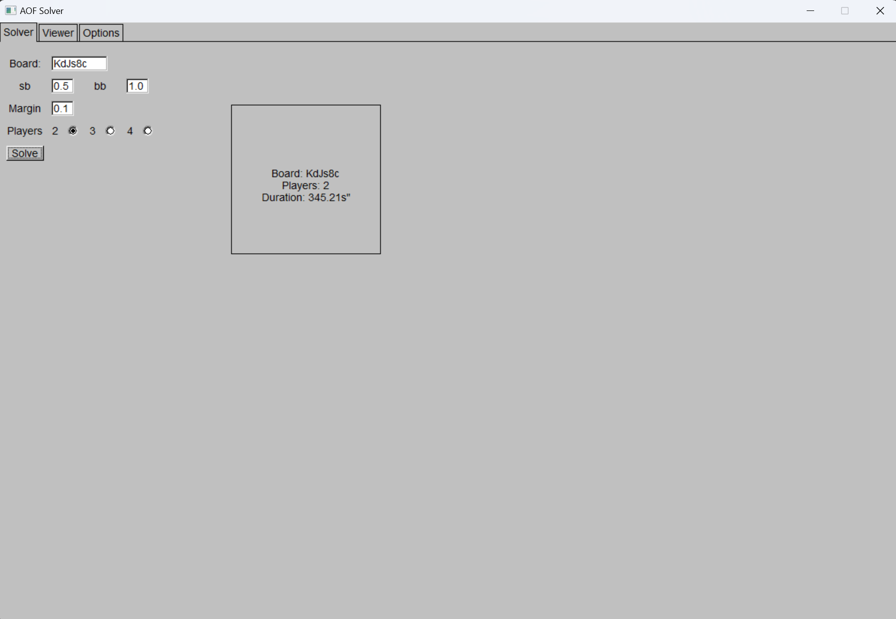

# AOF Omaha Solver

An **All-in or Fold (AOF) Omaha** solver and strategy viewer for the 4-card variant of Omaha poker,  
as played on platforms like GGpoker.  

This tool allows you to compute optimal strategies and explore decisions in different spots.  
It is intended for players and researchers who are already familiar with the rules of Omaha, which are outside the scope of this project.

## Overview

This project includes both a **solver** and a **strategy viewer** for the All-in or Fold (AOF) Omaha format.  

The solver is an **iterative, multithreaded engine** that computes approximate strategy solutions for any predefined flop situation. It supports **2-, 3-, and 4-player games**.  
Because it is designed to run on typical consumer hardware (with limited CPU and RAM), the solver uses certain **approximations and optimizations** to deliver solutions within a reasonable time, while maintaining reasonable accuracy.  

The strategy viewer allows users to **load precomputed solutions** and browse strategies for different spots.  
It also provides **hand filtering** options to narrow down and study specific scenarios.

## Usage

### Precompiled Build
If you just want to run the application, a **precompiled build** is available inside the `Build/` folder.

### From Source
1. Clone this repository.  
2. Make sure [vcpkg](https://vcpkg.io/en/) is installed.  
3. Run:
   ``` 
   vcpkg install
4. Run: `GenerateSolution.bat` to build visual studio 2022 project files.

## Instructions

### Solver

**Inputs (under Solver tab):**

- **Board** – flop situation.  
- **SB / BB** – small blind and big blind sizes.  
- **Margin** - threshold (in BB) where all-in is still preferable over fold.  
  - Example: `0.2` margin means hands with `EV > -0.2` are still pushed.  
  - Useful for promotions often associated with this game (e.g., Fortune Jackpot, where margin ≈ `0.1` is typical).
 - **Players** – number of players to solve for.  
    - More players = longer solver time.  
    - On a 16-core/16-thread machine:  
      - 2 players ~ 5 min
      - 3 players ~ 25 min  
      - 4 players ~ 40 min

**Options (under Options tab):**

- **SaveDir** – save directory for solutions.  
  - Solutions are stored as:  
    ```
    [board]_[playerCount]p.sol
    ```
- **Threads** – number of threads to use (max = number of CPU cores).  
- **Chunk** – experimental, controls the chunk size each thread processes.  

### Viewer

- **Load** – load a solution file.  
- **Nodes** – load a sub-solution for a specific situation (e.g., **BB vs BU+SB** means solutions for BB facing BU going All-in and BU calling).  
- **Filtering** – basic filtering for cards, suits, and logical operators:  
  - Example: AK,QQ:ss:!sss → every AK or QQ with two spades, but not three spades.  
- **Trainer** – experimental mode that enables training for the current spot.  

## Algorithm

Each player is assigned an entire hand range, along with a single value representing the **expected value (EV)** of going all-in.  
If this value is below zero, folding is preferred (with adjusted thresholds for the small blind and big blind).  

For every hand in every player’s range, the algorithm calculates the **EV of pushing** against the opponents’ ranges. This is done by simulating multiple hand outcomes.  
After each iteration, the EV estimates for hands move closer to their true values.  

Because of the large number of combinations, this simulation step is the **main computational bottleneck**. The main challenge is that **4-card Omaha has vastly more possible hands than Texas Hold’em** (270,725 vs. 1,326). To calculate reasonable equity for each hand hundreds of iterations are required. On top of that, multiple possible spots exist (e.g., 14 distinct situations in a 4-player game). 

To make the solver practical, several **optimizations and concessions** were introduced:

- **Flat data layout** – all data is stored in a single contiguous vector, and accessed via indices. This improves cache locality and allows much faster data retrieval compared to scattered structures.

- **Parallelization** – since each hand in a range is independent of the others,  
  the computation can be split across multiple threads.  
  Each thread processes a portion of the range in parallel, significantly speeding up equity calculations.

- **Early stopping with thresholds** – the solver does not need the *exact* EV for every 
hand.  
  For example, whether a hand has EV = +0.01 or EV = +1.0, both are clear all-ins. The stronger(or weaker) a hand is, less iterations are needed to determine if hand is all in.

  During equity calculation, the solver continuously checks if a hand’s EV is already above or below a certain threshold and stoping early.  

  This significantly reduces solving time, but may also introduce small anomalies. Some hands can be misclassified if they converge too early, for that reason, results should always be compared against similar hands.

## Examples




## Dependecies

- [**PHeval**](https://github.com/HenryRLee/PokerHandEvaluator)  
  Efficient C++ **poker hand evaluator**, used for fast equity and hand strength calculations.  

- [**FLTK**](https://www.fltk.org/)  
  Lightweight, cross-platform **GUI toolkit**, used for UI.

- [**Premake**](https://premake.github.io/)  
  Flexible **build configuration tool**, used to generate project files.

- [**vcpkg**](https://vcpkg.io/en/)  
  Microsoft’s **C++ package manager**, used to fetch and manage third-party libraries consistently across platforms.

## Disclaimer

This software is provided "AS IS", without warranty of any kind, express or implied, including but not limited to the warranties of merchantability, fitness for a particular purpose, and non-infringement.  
In no event shall the authors or copyright holders be liable for any claim, damages, or other liability, whether in an action of contract, tort, or otherwise, arising from, out of, or in connection with the software or the use or other dealings in the software.   

## License

This project is licensed under the MIT License – see the LICENSE file for details.

You are free to use, modify, and distribute this code (including in commercial projects), provided that proper credit is given by including the original copyright and license notice in any copies or derivative works.
